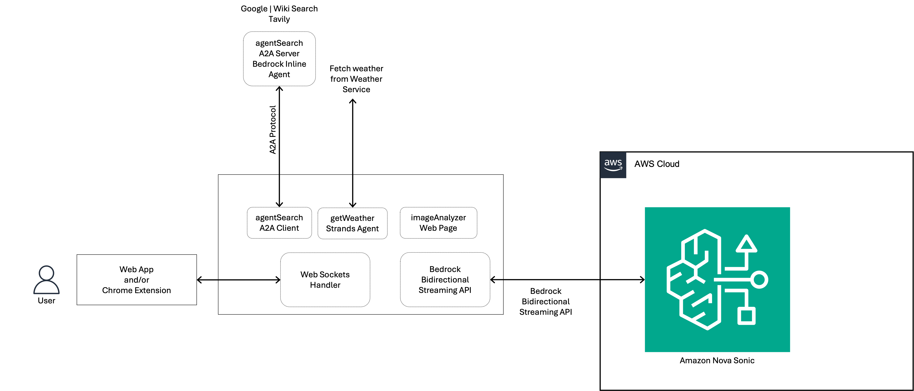

# Amazon Nova Sonic - Advanced Speech-to-Speech (S2S) Application Demo

This project demonstrates an advanced implementation of a Speech-to-Speech (S2S) application using the [Amazon Nova Sonic](https://aws.amazon.com/ai/generative-ai/nova/speech/) model on Amazon Bedrock. It has evolved from a simple S2S demo to showcase a modular architecture with support for both synchronous and asynchronous tool use, real-time bidirectional streaming, and an interactive chat interface built with vanilla JavaScript and Vite (frontend) and a Python backend. This project can serve as a starting point for complex conversational AI projects.

**Notes:**

May 2025

This code has been tested with the `amazon.nova-sonic-v1:0` version of the Amazon Nova Sonic model (the primary version available during testing). For the best experience, try with a wired headset and microphone combo.

## Key Features

  * **Real-time Speech-to-Speech:** Leverages Amazon Nova Sonic for low-latency voice conversations.
  * **Bidirectional Streaming:** Implements Amazon Bedrock's bidirectional streaming API for concurrent audio input/output and event handling.
  * **Modular Tool Framework:**
      * Easily extendable backend framework for adding new tools.
      * Tools are defined with specifications (name, description, input schema) for Amazon Nova Sonic.
  * **Synchronous Tool Support:**
      * Nova Sonic waits for tool execution to finish. Best for tools responding in less than a minute.
      * Examples:  
         - `getWeather` Dynamically fetches weather using the [Strands Agents](https://strandsagents.com/) only for U.S. cities, an open-source agents framework
         - `numberRace` A simple tool that takes a number provided and sleeps for those number of seconds!
  * **Asynchronous Tool Support (demonstrated with `agentSearch`):**
      * **Immediate Placeholder Response:** For long-running tools, an immediate placeholder message is sent to Nova Sonic to avoid timeouts and inform the user that the task has started.
      * **Background Task Execution:** The actual tool logic (e.g., A2A client call for `agentSearch`) runs as a background task in the Python backend.
      * **Out-of-Band UI Notification:** Once the background tool completes, a custom WebSocket message is sent to the frontend to notify the user in the chat interface (e.g., "Agent Search for 'Diwali' is complete.").
      * **Result Caching & Retrieval:** Completed asynchronous tool results are cached in the backend. When the user subsequently asks for these results (and Nova Sonic re-invokes the tool, potentially guided by an updated system prompt), the cached data is retrieved and provided.
  * **Frontend Interface:**
      * Built with HTML, CSS, and vanilla JavaScript (using Vite for development).
      * Real-time audio capture and streaming to the backend.
      * Real-time playback of Nova Sonic's audio responses.
      * Chat history display, including user speech, Nova Sonic responses, and tool completion notifications.
      * Voice selection for Nova Sonic's output.
  * **[Agent2Agent](https://github.com/google/A2A) A2A Protocol Integration:**
      * The `agentSearch` tool demonstrates integration with an external agent using an A2A protocol via a Python client. The necessary client-side `common` A2A libraries are included in the project.

## Architecture

The application consists of a frontend UI that captures user speech and plays back Nova Sonic's responses, and a Python backend that manages the WebSocket connection with the frontend and the bidirectional stream with Amazon Nova Sonic on Bedrock. The backend also orchestrates tool usage.



## Project Structure

```bash
.
├── arch.jpg
├── arch.png
├── backend
│   ├── __init__.py
│   ├── agents
│   │   └── bedrock
│   │       ├── __main__.py
│   │       ├── agent.py
│   │       ├── pyproject.toml
│   │       ├── README.md
│   │       ├── task_manager.py
│   │       └── utility.py
│   ├── common
│   │   ├── __init__.py
│   │   ├── client
│   │   │   ├── __init__.py
│   │   │   ├── card_resolver.py
│   │   │   └── client.py
│   │   ├── server
│   │   │   ├── __init__.py
│   │   │   ├── server.py
│   │   │   ├── task_manager.py
│   │   │   └── utils.py
│   │   ├── types.py
│   │   └── utils
│   │       ├── in_memory_cache.py
│   │       └── push_notification_auth.py
│   ├── lib
│   │   ├── __init__.py
│   │   ├── agent_search
│   │   │   ├── __init__.py
│   │   │   ├── agent_search_tool.py
│   │   │   └── agentclient.py
│   │   ├── number_race_tool.py
│   │   └── weather_tool.py
│   ├── nova_s2s_backend.py
│   ├── pyproject.toml
│   ├── README.md
│   └── uv.lock
├── frontend
│   ├── index.html
│   ├── package-lock.json
│   ├── package.json
│   ├── public
│   │   └── vite.svg
│   └── src
│       ├── javascript.svg
│       ├── lib
│       │   ├── play
│       │   │   ├── AudioPlayer.js
│       │   │   └── AudioPlayerProcessor.worklet.js
│       │   └── util
│       │       ├── ChatHistoryManager.js
│       │       └── ObjectsExt.js
│       ├── main.js
│       ├── style.css
│       ├── toolConfig.js
│       └── websocketEvents.js
└── README.md
```
## Deployment and Running

### Prerequisites

  * [uv](https://github.com/astral-sh/uv) (or `pip`) and Python \>= 3.12
  * Node.js and npm 
  * An AWS account with access to models on Amazon Bedrock - Amazon Nova Sonic, Amazon Nova Micro, Amazon Nova Lite
  * AWS Credentials configured in your environment (e.g., via `~/.aws/credentials` or environment variables `AWS_ACCESS_KEY_ID`, `AWS_SECRET_ACCESS_KEY`, `AWS_SESSION_TOKEN` (if applicable), and `AWS_REGION`).
  * (For `agentSearch` tool) A running A2A-compatible server. An example server can be run from `backend/agents/bedrock/`.
  * (For the example A2A Server in `backend/agents/bedrock/`) A [Tavily](https://tavily.com/) API Key (`TAVILY_API_KEY` environment variable).
  * (For `getWeather` tool) Ensure any dependencies and API key requirements for the Strands Agent Framework are met.

### Instructions

1.  **Starting the A2A Server (for `agentSearch` tool):**

      * Open a new terminal.
      * Navigate to the `backend/agents/bedrock/` folder.
      * Export your Tavily API key:
        ```bash
        export TAVILY_API_KEY="YOUR_TAVILY_API_KEY"
        ```
      * Start the A2A server (runnable with `uv run .` from that directory):
        ```bash
        uv run .
        ```
      * This server usually runs on `http://localhost:10000`. Keep this terminal running.

2.  **Starting the Backend Application:**

      * Open another new terminal.
      * Navigate to the `backend` folder.
      * Ensure your AWS credentials and region are configured (e.g., via environment variables or shared credentials file). Example for environment variables:
        ```bash
        export AWS_ACCESS_KEY_ID="YOUR_AWS_KEY_ID"
        export AWS_SECRET_ACCESS_KEY="YOUR_AWS_SECRET_KEY"
        export AWS_REGION="your-aws-region" # e.g., us-east-1
        # export AWS_SESSION_TOKEN="YOUR_SESSION_TOKEN" # If using temporary credentials
        ```
      * Install dependencies (if you haven't already or if `pyproject.toml` changed):
        ```bash
        uv sync 
        ```
      * Start the backend:
        ```bash
        uv run nova_s2s_backend.py
        ```
      * The backend application must remain running. It typically serves on `ws://localhost:8081`.

3.  **Starting the Frontend Application:**

      * Open a third new terminal.
      * Navigate to the `frontend` folder.
      * Install dependencies (if you haven't already):
        ```bash
        npm install
        ```
      * Start the application:
        ```bash
        npm run dev
        ```
      * Access the frontend by opening the URL shown (usually `http://localhost:5173/`) in your browser.

## Usage

**Getting Started:**

1.  Ensure all three components (A2A Server (if using `agentSearch`), Backend Application, Frontend Application) are running.
2.  Open the frontend URL in your browser.
3.  Click "Start Streaming" to begin the session with Nova Sonic.
4.  Speak into your microphone to interact.
5.  You can select an alternative voice for Nova Sonic from the 'Voice' dropdown.
6.  **Try invoking tools:**
      * "What's the weather in New York?" 
      * "Start a number race for 3 seconds."
      * "Agent search for Diwali." (Wait for the placeholder, then the UI notification "Search complete...")
      * Then ask: "What were the agent search results for Diwali?" (to test cached result retrieval).

## Implementing New Tools

This application is designed for easy extension with new tools.

### Adding a New Synchronous Tool

1.  **Backend:**
      * Create `backend/lib/my_new_sync_tool.py`.
      * Implement `async def handle_my_new_sync_tool(manager_instance, tool_use_content: dict) -> dict:` (returns `{"result": "...", "status": "success"}`). The `manager_instance` argument is passed to all handlers for consistency but may not be used by simple synchronous tools.
      * Implement `def get_my_new_sync_tool_spec() -> dict:` (returns Nova Sonic tool spec).
      * In `backend/nova_s2s_backend.py`: Import handler/spec from `lib.my_new_sync_tool` and register in `BedrockStreamManager.tool_handlers` and `tool_specs_definitions`.
2.  **Frontend:**
      * In `frontend/src/toolConfig.js`, add the tool's specification to `getToolSpecifications()`.

### Adding a New Asynchronous Tool

1.  **Backend:**
      * Create a sub-package in `backend/lib/` (e.g., `my_async_tool/` with `__init__.py`).
      * Place any specific client logic (e.g., `my_async_client.py`) and its dependencies inside this sub-package.
      * Create `backend/lib/my_async_tool/my_async_tool_handler.py` (or similar).
          * Implement any client initialization/retrieval logic within this module (e.g., `async def get_initialized_my_client()`).
          * Implement `async def _execute_actual_async_work(params...) -> dict:` (returns data for cache).
          * Implement the main `async def handle_my_async_tool(manager_instance, tool_use_content: dict) -> dict:`. This handler will:
            1.  Check `manager_instance.completed_async_tool_results` for cached data (keyed by `tool_name.lower()`).
            2.  If no cache, check `manager_instance.active_background_tasks` (keyed by `tool_use_id`) for an existing task for this *specific invocation*.
            3.  If new work is needed, define an `actual_op_coro_factory = lambda: _execute_actual_async_work(...)`.
            4.  Call `await manager_instance.launch_background_tool_task(tool_use_id, tool_name, actual_op_coro_factory)`.
            5.  Return an immediate placeholder `{"result": "Working on it...", "status": "success"}`.
      * In `BedrockStreamManager` (`backend/nova_s2s_backend.py`):
          * The existing `launch_background_tool_task` method is generic and will handle running the coroutine, caching results (in `completed_async_tool_results`), and queueing the `CustomToolNotification`.
          * Import and register your new async tool handler and spec (e.g., from `lib.my_async_tool.my_async_tool_handler`).
2.  **Frontend:**
      * Add the tool's spec to `frontend/src/toolConfig.js`.
      * The existing `handleToolCompletionNotification` in `websocketEvents.js` will display the UI notification for events with `customEvent: "toolCompletionNotification"`.

For detailed examples, refer to `weather_tool.py` (synchronous) and the `agent_search/` package (asynchronous) in `backend/lib/`.
The `agentSearch` tool uses an A2A client defined in `backend/lib/agent_search/agentclient.py`, which in turn uses shared A2A common libraries located in `backend/common/`.

## About
This project is licensed under the Apache License 2.0, and is open to contributions from the community.